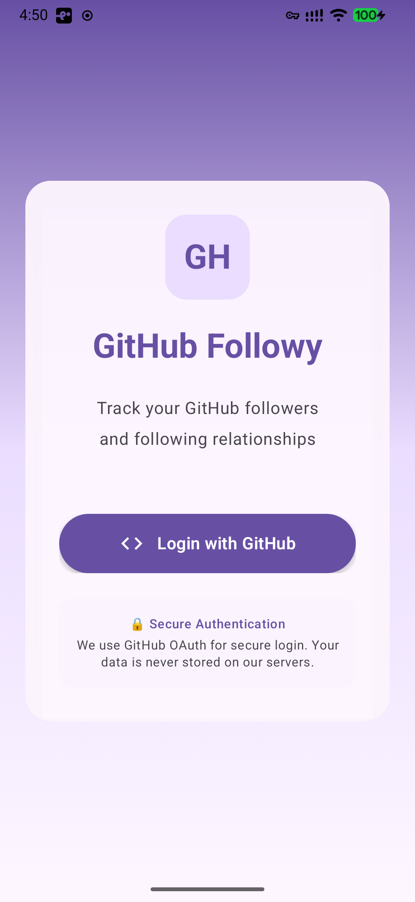

# GitHub Followy

A Kotlin Multiplatform app that helps you manage your GitHub followers across **Android**, **iOS**, **Desktop**, and **Web** platforms.


## ✨ Features

### ✅ Implemented
- 🔐 **GitHub OAuth 2.0** - Secure, modern web-based authentication flow
- 🌐 **Web Target (Wasm)** - Fully functional Web version using Compose for Web (WebAssembly)
- 🔒 **AES-256 Encryption** - Tokens encrypted with platform-native security (EncryptedSharedPreferences on Android, Keychain on iOS)
- 👥 **Follower Analysis** - See who follows you but you don't follow back
- 🔄 **Following Analysis** - See who you follow but they don't follow back
- ➕ **Follow Users** - Follow users directly from the app
- ➖ **Unfollow Users** - Unfollow users with a single tap
- 🔄 **Real-time Updates** - UI updates instantly after actions
- 📱 **Cross-Platform** - Shared UI and logic across Android, iOS, Desktop, and Web
- 🎨 **Modern UI** - Built with Compose Multiplatform 1.7.3 and Material 3
- 🛡️ **Security First** - No hardcoded secrets; dynamic configuration loading
- 🚀 **Splash Screen** - Native Android 12+ splash screen with custom icon
- 🔄 **Pull-to-Refresh** - Material 3 pull-to-refresh on user lists
- ⚙️ **Settings Screen** - Dedicated settings page with app version and logout
- 🧭 **Type-Safe Navigation** - Shared navigation logic across all targets
- 👤 **User Profile Screen** - View detailed profiles and toggle follow status

## 📸 Screenshots

| Platform | Screenshot | Description |
|-----------|------------|-------------|
| 🌐 **Web** |  | High-performance Wasm-based web dashboard |
| 📱 **Mobile** |  | Modern login screen with OAuth authentication |
| |  | Three-tab dashboard showing follower comparisons |

## 🚀 Quick Start

### Prerequisites

- JDK 17 or higher
- Android Studio or IntelliJ IDEA
- GitHub OAuth App ([Create one here](https://github.com/settings/developers))
  - Homepage URL: `http://localhost:8080`
  - Callback URL: `http://localhost:8080`

### Building & Running

#### 🤖 Android
```bash
./gradlew :androidApp:installDebug
```

#### 🖥️ Desktop
```bash
./gradlew :desktopApp:run
```

#### 🌐 Web (Wasm)
The Web version uses a built-in proxy to handle GitHub's CORS restrictions during development.
```bash
./gradlew :webApp:wasmJsBrowserDevelopmentRun
```
Access the app at `http://localhost:8080`.

## 🏗️ Architecture

The app follows **Clean Architecture** principles:

- **Shared Module**: Contains 100% of the UI (Compose) and Business Logic.
- **Web module**: Specific entry point for WebAssembly target.
- **Data Layer**: Ktor for networking, Ktor-Network-Coil for images.
- **OAuth Provider**: Decoupled interface for providing credentials at runtime without hardcoding.

### Technology Stack

- **Kotlin Multiplatform (KMP)**
- **Compose Multiplatform 1.7.3**
- **Coil 3** - Async image loading with Ktor network fetcher
- **Koin** - Dependency injection
- **Ktor 3.0** - Networking and OAuth token exchange
- **Webpack** - Dev server with CORS proxy configuration

## 🔒 Configuration (Web)

For the Web version, secrets are loaded dynamically from the `index.html` to avoid including them in the compiled Wasm binary.

Update `webApp/src/wasmJsMain/resources/index.html`:
```html
<script type="text/javascript">
    window.clientId = "YOUR_CLIENT_ID";
    window.clientSecret = "YOUR_CLIENT_SECRET";
</script>
```

## 📚 Documentation

- [Getting Started Guide](GETTING_STARTED.md) - Quick start for developers
- [Implementation Summary](IMPLEMENTATION_SUMMARY.md) - Technical details
- [Security Documentation](SECURITY.md) - Comprehensive security guide

## 📄 License

MIT License
