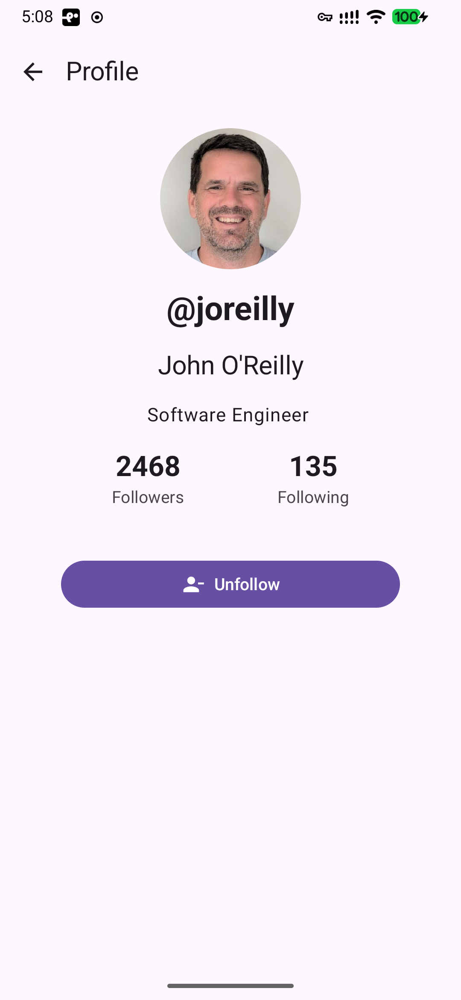

# GitHub Followy

A Kotlin Multiplatform app that helps you manage your GitHub followers across **Android**, **iOS**, **Desktop**, and **Web** platforms.


## ✨ Features

### ✅ Implemented
- 🔐 **GitHub Authentication** - Secure login with Personal Access Token
- 🔒 **AES-256 Encryption** - Tokens encrypted with platform-native security
- 👥 **Follower Analysis** - See who follows you but you don't follow back
- 🔄 **Following Analysis** - See who you follow but they don't follow back
- ➕ **Follow Users** - Follow users directly from the app
- ➖ **Unfollow Users** - Unfollow users with a single tap
- 🔄 **Real-time Updates** - UI updates instantly after actions
- 📱 **Cross-Platform** - Works on Android, iOS, Desktop, and Web
- 🎨 **Modern UI** - Built with Compose Multiplatform and Material 3
- 🛡️ **Security First** - Hardware-backed encryption, secure logging, token validation
- 🎯 **Custom App Icon** - Branded icon with "Followy" branding across all densities
- 🚀 **Splash Screen** - Native Android 12+ splash screen with custom icon
- 🔄 **Pull-to-Refresh** - Material 3 pull-to-refresh on user lists
- ⚙️ **Settings Screen** - Dedicated settings page with app version and logout
- 🧭 **Type-Safe Navigation** - Kotlin serialization-based navigation with state preservation
- 🔙 **Tab State Preservation** - Returns to the same tab when navigating back from profile
- 👤 **User Profile Screen** - View profile details with follow/unfollow actions
- 🔒 **Restricted User Detection** - Identifies users with private activity or disabled following

## 📸 Screenshots

| Platform | Screenshot | Description |
|-----------|------------|-------------|
| 📱 **Mobile** |  | Modern login screen with OAuth authentication and gradient design |
| |  | Three-tab dashboard showing followers, follow back, and following lists |
| |  | User profile screen with follow/unfollow actions and user details |
### 🚧 Planned Features
- [ ] 🌓 **Dark/Light Theme Support** - Toggle between dark and light themes
- [ ] 🌍 **Multi-Language Support** - Internationalization for multiple languages
- [ ] 📬 **Daily Notifications** - WorkManager task that runs once daily to check for new followers/unfollowers and send local notifications
- [ ] ⚙️ **Notification Settings** - Enable/disable daily notifications and configure frequency in settings
- [ ] 🚫 **Block Users** - Block users and maintain a block list

## 🚀 Quick Start

### Prerequisites

- JDK 17 or higher
- Android Studio or IntelliJ IDEA
- Xcode (for iOS development)
- GitHub Personal Access Token ([Create one here](https://github.com/settings/tokens))
  - Required scopes: `user`, `user:follow`

### Building & Running

#### 🤖 Android
```bash
./gradlew :androidApp:installDebug
```

#### 🖥️ Desktop
```bash
./gradlew :desktopApp:run
```

#### 🍎 iOS
Open `iosApp/templateIOS.xcodeproj` in Xcode and click Run

#### 🌐 Web
```bash
./gradlew :shared:jsRun
```
Or for production build:
```bash
./gradlew :shared:jsBrowserDistribution
```

## 🏗️ Architecture

The app follows **Clean Architecture** principles with clear separation of concerns:

```
📦 shared/src/commonMain
 ├── 📂 data
 │   ├── 📂 api          # GitHub API client (Ktor)
 │   ├── 📂 models       # Data models
 │   ├── 📂 repository   # Business logic
 │   └── 📂 local        # Token storage
 ├── 📂 di               # Dependency injection (Koin)
 └── 📂 ui
     ├── 📂 auth         # Login screen & ViewModel
     └── 📂 dashboard    # Dashboard & ViewModels
```

### Technology Stack

- **Kotlin Multiplatform** - Share 100% of business logic
- **Compose Multiplatform** - Modern declarative UI
- **Ktor** - Type-safe HTTP client
- **Koin** - Lightweight dependency injection
- **Kotlinx Serialization** - JSON parsing
- **Coil3** - Async image loading
- **Coroutines & Flow** - Reactive programming
- **Security** - AES-256 encryption, hardware-backed keystore

## 🔒 Security

1. **Create GitHub Token**
   - Go to [GitHub Settings > Tokens](https://github.com/settings/tokens)
   - Generate new token (classic)
   - Select scopes: `user` and `user:follow`
   - Copy the token

2. **Launch the App**
   - Enter your token on the login screen
   - Click "Login"

3. **Manage Followers**
   - **Tab 1**: Users who follow you but you don't follow back → Click "Follow"
   - **Tab 2**: Users you follow but they don't follow back → Click "Unfollow"
   - Click refresh icon to reload data

## 📊 API Rate Limits

GitHub API allows **5,000 authenticated requests per hour**. The app fetches followers/following in batches of 100 users. 

## 🔮 Additional Future Enhancements

- [ ] OAuth web flow authentication
- [ ] Local caching with SQLDelight
- [ ] Batch follow/unfollow operations
- [ ] User search and filtering
- [ ] Follower statistics and charts
- [ ] Export data to CSV
- [ ] Multiple account support
- [ ] Follower/Following history tracking
- [ ] In-app notifications for follow/unfollow events
## 📚 Documentation

- [Getting Started Guide](GETTING_STARTED.md) - Quick start for developers
- [Implementation Summary](IMPLEMENTATION_SUMMARY.md) - Technical details
- [Developer Checklist](DEVELOPER_CHECKLIST.md) - Build and test guide
- [Security Documentation](SECURITY.md) - Comprehensive security guide

## 🤝 Contributing
## 🤝 Contributing

Contributions are welcome! Please feel free to submit a Pull Request.

## 📄 License

MIT License

## 🙏 Acknowledgments

- Built with [Compose Multiplatform](https://www.jetbrains.com/lp/compose-multiplatform/)
- Powered by [GitHub API](https://docs.github.com/en/rest)
- Template based on [Compose Multiplatform Template](https://github.com/AdamMc331/CMPTemplate)
